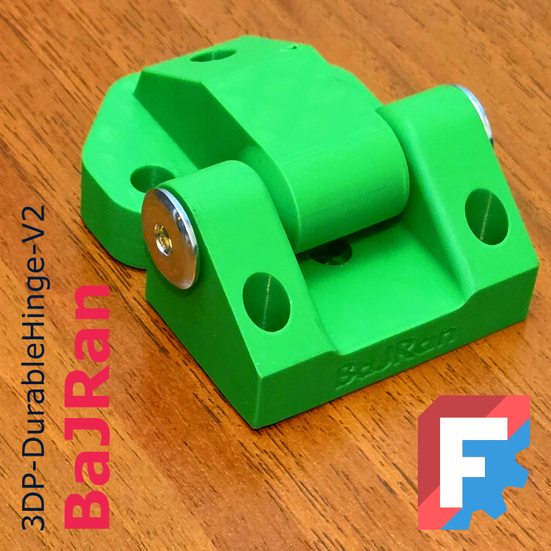

<!-- Begin README -->


<p align="center">
    <font size="5"><b>3DP-DurableHinge-V2</b></font><br>
    <font size="4">Durable hinge with enhanced steel components</font>
</p>
<div align="center">
    
</div>
<br>
<p align="center">
    <a href="https://daringfireball.net/projects/markdown/"></a>
    <a href="https://github.com/bajraan"></a>
    <a href="mailto:bajran1616@gmail.com"></a>
    <br>
</p>

> [!IMPORTANT]
> **This model consists of a few variants. Check the list below and choose the one that best fits your needs.**
> [!NOTE]
>```markdown
>PIN VARIANTS:
>|----|------------------------------------|---|
>| A  | Metal rod M8 and Ericsson          |   |
>| B  | Printed Pin                        |   |
>| C  | Metal DIN912 Screw and nut         |   |
>MOUNTING VARIANTS:
>|----|------------------------------------|---|
>| G  | Metal DIN912 Screw and wood insert |   |
>| H  | Pocket screw MILESCRAFT 5201       |   |
>```

> [!NOTE]
>```markdown
>| nr | Part name                    | cnt | Comment             |
>|----|------------------------------|-----|---------------------|
>| 1  | HINGE__Base                  | x 1 | Print               |
>| 2  | HINGE__Arm                   | x 1 | Print               |
>| 3  | Ericsson flat head nut M8    | x 2 | wood furniture Part |
>| 4  | Steel threaded rod     M8X55 | x 7 | wood furniture Part |
>| 5  | Screw DIN912           M5x20 | x 7 | Regular steel Part  |
>| 6  | Wood insert nut        M5x12 | x 1 | Regular steel Part  |
>| 7  | HINGE__Pin                   | x 2 | Print               |
>| 8  | HINGE__Pin_Nut               | x 2 | Print               |
>| 9  |                              |     |                     |
>| 10 | Screw DIN912           M8x75 | x 2 | Regular steel Part  |
>| 11 | Nut                    M8    | x 2 | Regular steel Part  |
>| 12 | HINGE__Spacer                | x 2 | Print               |
>| 13 | Pocket Screw MILESCRAFT 5201 | x 2 | Regular steel Part  |
>```

<div align="center">
     
</div>

<div align="center">
    
</div>

<div align="center">
    
</div>


<p align="center">
    <font size="6"><b>Gallery</b></font><br>
</p>

<div align="center">
    
</div>

<div align="center">
    
</div>

<div align="center">
    
</div>

<!-- End README -->